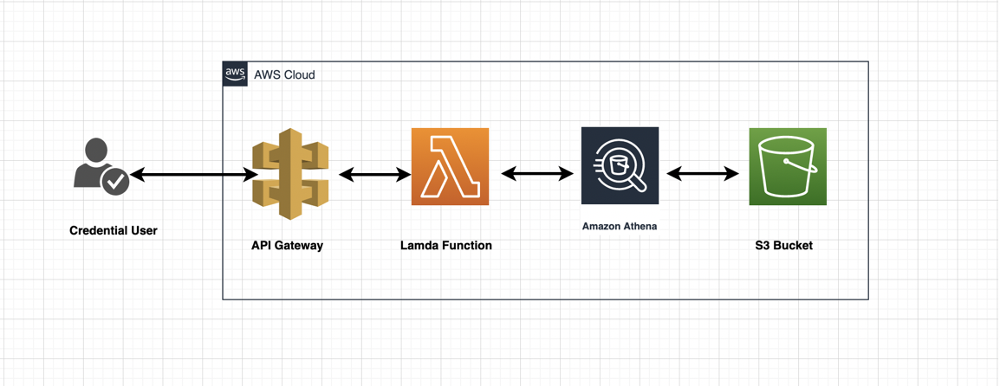

# Deploying AWS ETL
This is a User documentation on provisioning and deploying sample ETL on AWS. In this workflow, we demonstrate how to leverage serverless architecture with Big data(Athena) on AWS platform to analyze data and transform them to useful information. A sample big data is stored in an S3 bucket and we use Athena to query this data through lambda invocation via Rest API Gateway. 

## A. Introduction
The purpose of this guide is to provide instructions on how to provision and deploy AWS ETL. This guide assumes that the User has an operating account with Amazon Web Services
[Amazon Web Services](https://aws.amazon.com) and all the necessary administrator's IAM role and permissions in order to create cloud resources. 

### B. Disclaimer
AWS is a Pay As You Go provider, as result the use of this instruction may result in  usage charges. We're in no way responsible for any charges incurred from resources created using this documentation.

All scripts related to this documentation can be found here: [cloudprofessionals](https://github.com/cloudprofessionals/portfolio)

## C. Architecture
The code in this demo will create the following resources via Terraform:

* Rest API Gateway
* Athena
* Lambda
* S3 Bucket



## D. Pre-requisites
Ensure you have the following tools installed and configured before proceeding. All instructions provided here assumes you have unix-like environment

#### a) AWS CLI
* Follow the instructions on official Amazon Web site to [install](https://docs.aws.amazon.com/cli/latest/userguide/install-cliv2.html) AWS CLI on your local machine using platform instruction applicable to you.

#### b) Configure AWS Credentials
Please ensure you have aws credential configured for your environment [aws credentials](https://docs.aws.amazon.com/cli/latest/userguide/cli-configure-files.html). This document does not make provision for access and secret keys due to unintended security reasons. 

#### c) Terraform
* Follow the instructions on the official [Terraform](https://learn.hashicorp.com/terraform/getting-started/install.html) site to install terraform on your local workstation using platform instruction applicable to you.

#### d) Git
* Follow the instructions on the official [Git](https://github.com/git-guides/install-git) site to install git on your local workstation.

#### d) Python3 and Virtual Environment
* Follow the instructions on the official [Python](https://www.python.org/downloads/) site to install python3 and [venv](https://docs.python.org/3/library/venv.html) on your local workstation.


## E. Installations

#### a) Clone cloudprofessionals repo

* Clone  [cloudprofessionals](https://github.com/cloudprofessionals/portfolio) to a working directory. In this guide, I will be using  **/tmp** as my working directory
    
```
cd /tmp && git clone https://github.com/cloudprofessionals/portfolio
```

* Change directory to the scripts location **terraform/etl**

```
cd terraform/etl
```

#### b) Populate vars.tfvars file

*  Using your favorite text editor open and edit **${WORKING-DIRECTORY}/portfio/terraform/etl/vars.tfvars** file. This is a variable file that will be used as input to the terraform. 
*  Please refer to **${WORKING-DIRECTORY}/portfio/terraform/etl/variables.tf** file for full descriptions of each the variables listed in the vars.tfvars file. 
*  At minimum, you will need to provide appropriate values for the following;
	* 	profile - This is the name of the aws crendential profile you set above in step D).b
	*  region - This is the aws region you wish to provision your resources.
	* athena_s3_bucket - This is globally unique name for the bucket that will store our sample cases and results 

* Run **terraform init** 

```
terraform init
```

*  Run **terraform plan**. This command gives you insight into all the resources that will be created. Review the output and if satisfy continue to the next step

```
terraform plan -var-file=vars.tfvars
```

* Run **terraform apply** to provision your infrastructure.
```
terraform apply -var-file=vars.tfvars -auto-approve
```

* At this point, if there are no errors your infrastructure will be provisioned. Note it will take about 5 minutes for the application to completely deployed.


### d) Verify the ETL deployment
Once the deployment is complete, you're ready to make an api request to your rest endpoint. Run the supplied python client script located in **${WORKING-DIRECTORY}/portfio/terraform/etl/test/client** to verify that you're able to return data successfully.

```
python test/client.py
```

### e) Teardown
To destroy resouces created in this demo;

* Run **terraform destroy** to destroy the resources provisioned. Note you will get error during this step is the created s3 bucket is not empty. 

```
terraform destroy -var-file=vars.tfvars -auto-approve
```

